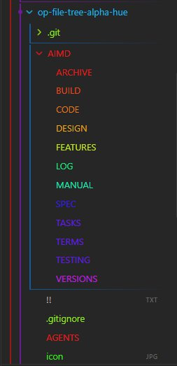

# File Tree Alpha Hue

Colors file explorer items according to their first alphabetical character using custom data attributes and muted resting color states.



[](https://www.buymeacoffee.com/markcrobbins)

## 📑 AI Primary Files
- 🔹 [AGENTS.md](AGENTS.md)
- 🔹 [ARCHIVE.md](AIMD/ARCHIVE.md)
- 🔹 [BUILD.md](AIMD/BUILD.md)
- 🔹 [CODE.md](AIMD/CODE.md)
- 🔹 [DESIGN.md](AIMD/DESIGN.md)
- 🔹 [FEATURES.md](AIMD/FEATURES.md)
- 🔹 [LOG.md](AIMD/LOG.md)
- 🔹 [MANUAL.md](AIMD/MANUAL.md)
- 🔸 [README.md](README.md)
- 🔹 [SPEC.md](AIMD/SPEC.md)
- 🔹 [TASKS.md](AIMD/TASKS.md)
- 🔹 [TERMS.md](AIMD/TERMS.md)
- 🔹 [TESTING.md](AIMD/TESTING.md)
- 🔹 [VERSIONS.md](AIMD/VERSIONS.md)

## 🔍 Table of Contents
- [[#🎯 Project Abstract & Core Value]] ^toc-abstract
- [[#🛠️ Technology Stack at a Glance]] ^toc-stack
- [[#🗺️ Project Layout Blueprint]] ^toc-blueprint
- [[#⚡ Quick Start for AI Developers]] ^toc-quickstart
- [[#Go to...]] ^toc-goto

## 🎯 Project Abstract & Core Value
[[#^toc-abstract|TOC]]
- An efficient Obsidian desktop plugin that scans file explorer navigation items, matches their first alphabetical character via regex, and stamps them with matching data attributes (`data-alpha-char`). This builds a dynamic, high-performance UI stylesheet layer that colors folders and markdown files across a 360-degree HSL hue spectrum without incurring DOM layout reflow penalties.

---

## 🛠️ Technology Stack at a Glance
[[#^toc-stack|TOC]]
- **Target Operating System:** Cross-platform (Windows, macOS, Linux desktop targets running Obsidian)
- **Core Languages & Runtimes:** JavaScript (CommonJS modules format), Node.js runtime environment API, HTML5 DOM API
- **Integrations:** Obsidian API (`Plugin`, `debounce`, workspace layout event hooks), DOM `MutationObserver` Engine

---

## 🗺️ Project Layout Blueprint
[[#^toc-blueprint|TOC]]
- **`AGENTS.md`** ➔ System prompts and operational boundaries for AI teammates.
- **`AIMD/ARCHIVE.md`** ➔ Scriptorium for scrapped ideas and sunset components.
- **`AIMD/BUILD.md`** ➔ Compiler pipelines, flags, and packaging steps.
- **`AIMD/CODE.md`** ➔ Syntax style guidelines and error-handling mandates.
- **`AIMD/DESIGN.md`** ➔ Structural topology, design patterns, and data flows.
- **`AIMD/FEATURES.md`** ➔ Capability matrices and functional product roadmap.
- **`AIMD/LOG.md`** ➔ Chronological audit trail of development decisions.
- **`AIMD/MANUAL.md`** ➔ Installation, user runbooks, and diagnostic workflows.
- **`README.md`** ➔ Primary entry point and structural system abstract.
- **`AIMD/SPEC.md`** ➔ Technical constraints, parameters, and protocol definitions.
- **`AIMD/TASKS.md`** ➔ Dynamic task board and backlog management queue.
- **`AIMD/TERMS.md`** ➔ Technical glossary, definitions, and vocabulary indexes.
- **`AIMD/TESTING.md`** ➔ Automation suites, edge cases, and QA assertion routines.
- **`AIMD/VERSIONS.md`** ➔ Change trackers and version milestone evolution lists.

---

## ⚡ Quick Start for AI Developers
[[#^toc-quickstart|TOC]]

### 1. Verify Environment
```cmd
node -v && npm -v
```

### 2. Compile & Run Tests
```cmd
npm install && npm run build
```

---
## 🚀 Go to...
[[#^toc-goto|TOC]]
- 🔹 [AGENTS.md](AGENTS.md)
- 🔹 [ARCHIVE.md](AIMD/ARCHIVE.md)
- 🔹 [BUILD.md](AIMD/BUILD.md)
- 🔹 [CODE.md](AIMD/CODE.md)
- 🔹 [DESIGN.md](AIMD/DESIGN.md)
- 🔹 [FEATURES.md](AIMD/FEATURES.md)
- 🔹 [LOG.md](AIMD/LOG.md)
- 🔹 [MANUAL.md](AIMD/MANUAL.md)
- 🔸 [README.md](README.md)
- 🔹 [SPEC.md](AIMD/SPEC.md)
- 🔹 [TASKS.md](AIMD/TASKS.md)
- 🔹 [TERMS.md](AIMD/TERMS.md)
- 🔹 [TESTING.md](AIMD/TESTING.md)
- 🔹 [VERSIONS.md](AIMD/VERSIONS.md)

